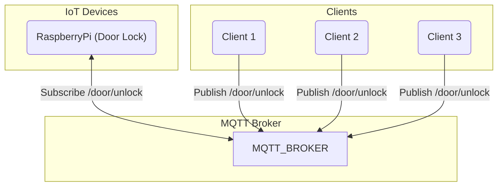
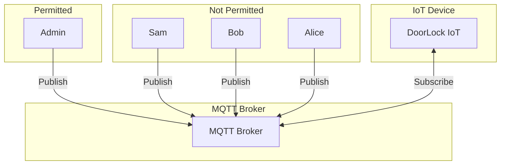
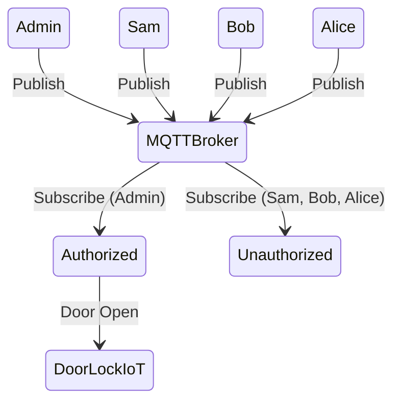
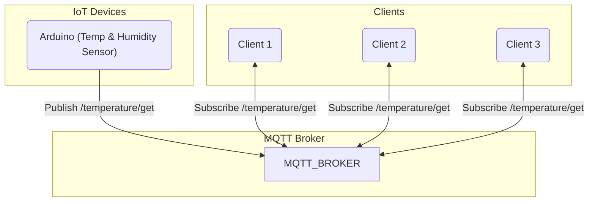
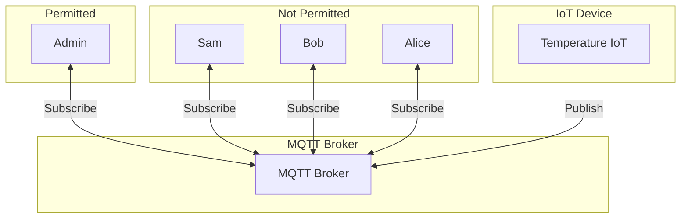
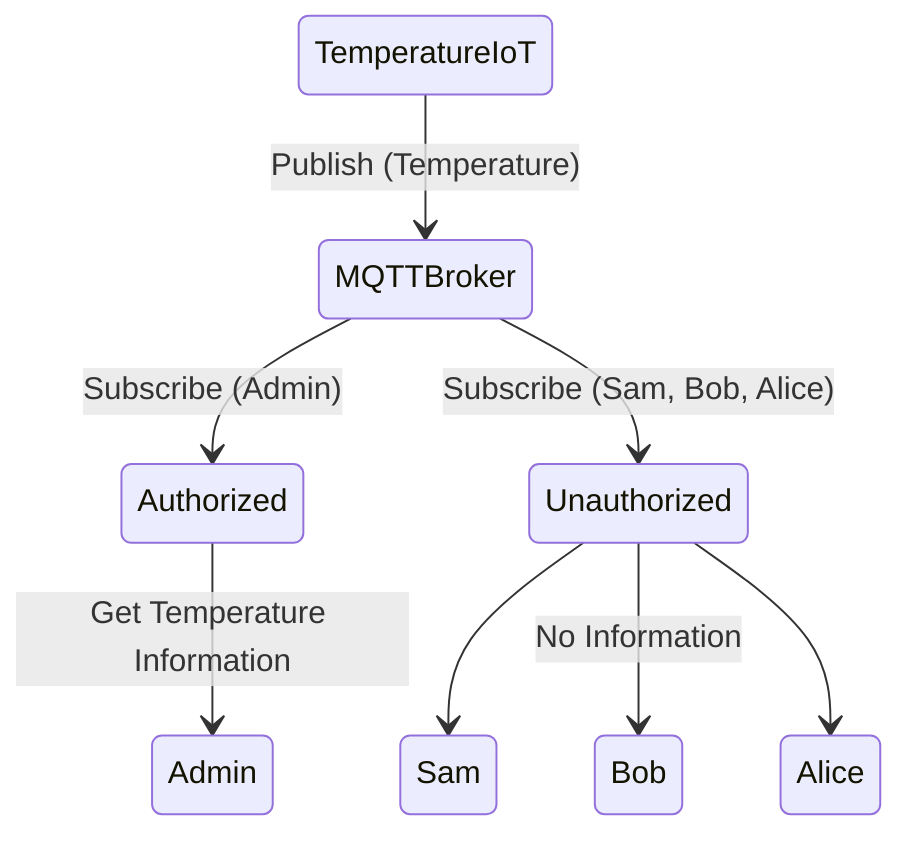

# URMQTT: User-Defined Rule based routing MQTT Broker 구현 및 IoT 적용

- 숭실대학교 소프트웨어학부 20211687 박성준
- 숭실대학교 소프트웨어학부 20211699 이든솔
- 숭실대학교 소프트웨어학부 20201741 오주원

## 코드
- mqtt.html : [Paho Javascript Client](https://www.eclipse.org/paho/index.php?page=clients/js/index.php) 사용해서 MQTT Broker에 연결하는 클라이언트 웹상으로 구현
- arduino-temperature.py : 시러얼 통신으로 받아온 온도 센서 정보를 MQTT 프르토콜을 이용해서 서버에게 데이터를 Publish하는 코드
- mqtt-doorlock.py : 라즈베리파이에서 실행되는 코드로 MQTT Broker에 `door/unlock` Topic을 Subscribe를 하고, 해당 Topic을 구독한 사용자들이 open을 보내면 도어락을 열어줌(부저, LED, 서브모터, RFID 사용)
- raspberrypi-doorlock.py : 라즈베리파이에서 실행되는 코드로 RFID를 처리해주는 코드

## 시나리오
회사에서 MQTT 프로토콜을 사용하여 구현된 Smart Company 보안 시스템을 시연합니다. 시스템에는 도어락, 온도 센서 등이 연결되어 있으며, 이를 통해 외부에서 모니터링하고 제어할 수 있습니다.

## 구현 과정
Raspberry Pi에는 도어락, Arduino에는 온도센서를 MQTT로 데이터를 처리하도록 구현했습니다.
이 IoT기기를 중앙 MQTT Broker에 연결하고 IoT기기들이 Topic을 Publish하면 클라이언트들이 도어락에는 문 열림닫힘 기능을 수행하고, 온도센서로 정보 가져올 수 있습니다. 하지만, Broker에 ACL(Access Control List)와 Filter Mapping을 구현해서 특정 권한이 있는 사용자들만 도어락을 제어하고, 온도 정보를 가져올 수 있습니다.

## 도어락

### 작동 방식

### 권한 분리

### 내부 처리

## 온도

### 작동 방식

### 권한 분리

### 내부 처리
